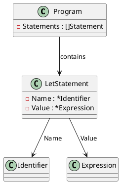

Expressions produce values, Statements don't

## Let Statement
```
let <identifier> = <expression>;
```

```plantuml
@startuml

class Program {
    - Statements : []Statement
}

class LetStatement {
    - Name : *Identifier
    - Value : *Expression
}

class Identifier

class Expression

Program --> LetStatement : contains
LetStatement --> Identifier : Name
LetStatement --> Expression : Value

@enduml
```